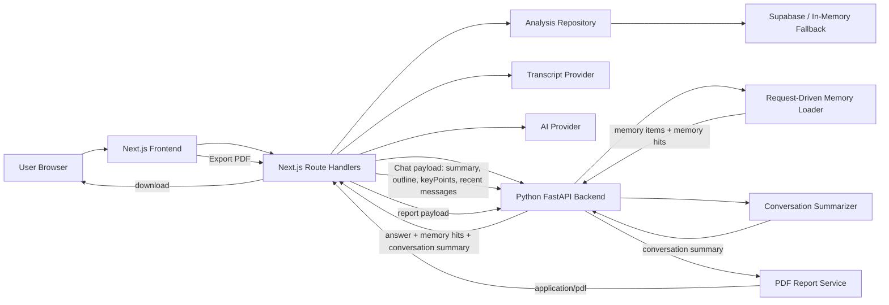

# AI Video Insight

AI Video Insight is a dual-service project built with Next.js and a Python FastAPI backend. It turns a video URL or local MP4 upload into a reusable analysis workspace with transcript-based summaries, multi-turn chat, request-driven memory, and PDF export.

## What It Does

- Analyze a video from a URL or uploaded MP4
- Fetch transcript context through pluggable transcript providers
- Generate structured results with title, summary, outline, and key points
- Support multi-turn Q&A against the current analysis
- Forward chat requests from Next.js to a Python AI backend
- Inject short-term memory, long-term analysis context, and compressed conversation summary into chat
- Support a LangGraph-powered ReAct-style chat loop that can inspect summary, outline, memory, and retrieved transcript evidence before answering
- Export the current analysis and chat history as a downloadable PDF

## Tech Stack

- Next.js 16 App Router
- React 19
- Route Handlers for server APIs and download proxies
- Python FastAPI backend for chat orchestration, memory shaping, summarization, and PDF generation
- Supabase Auth + Postgres repository fallback
- Pluggable transcript provider layer
- Pluggable AI provider layer
- ReportLab for PDF generation

## Services

### Next.js App

- dashboard and analysis detail UI
- video analysis task orchestration
- transcript and AI summary pipeline
- Route Handlers for analysis, chat, auth, and PDF download proxy
- analysis repository backed by Supabase or in-memory fallback

### Python Backend

- `POST /api/chat/respond` for chat orchestration
- LangGraph-backed ReAct-style tool loop for grounded follow-up answers
- request-driven memory loading and conversation summary compression
- `POST /api/report/pdf` for PDF generation
- clean service boundaries for future real retrieval and summarization models

## Local Development

Run the two services in separate terminals.

### 1. Start Next.js

```bash
npm install
npm run dev
```

### 2. Start the Python backend

```bash
cd python-backend
python -m venv .venv
.venv\Scripts\activate
pip install -r requirements.txt
Copy-Item .env.example .env
uvicorn app.main:app --reload --host 127.0.0.1 --port 8001
```

Open [http://localhost:3000/dashboard](http://localhost:3000/dashboard).

## Environment

Add these items to [`.env.local`](/C:/Users/31744/Desktop/ai-video-insight/.env.local):

```bash
# Supabase
NEXT_PUBLIC_SUPABASE_URL=
NEXT_PUBLIC_SUPABASE_PUBLISHABLE_KEY=
SUPABASE_SERVICE_ROLE_KEY=

# AI provider
AI_PROVIDER=mock
AI_BASE_URL=
AI_API_KEY=
AI_MODEL=
AI_TIMEOUT_MS=25000
CHAT_MODEL_ADAPTER=langgraph

# Python backend
PYTHON_BACKEND_BASE_URL=http://127.0.0.1:8001
PYTHON_BACKEND_TIMEOUT_MS=20000

# Transcript provider
TRANSCRIPT_PROVIDER=mock
YT_DLP_BIN=yt-dlp
```

`PYTHON_BACKEND_BASE_URL` links the Next.js Route Handlers to the FastAPI backend for chat and PDF export.
Set `CHAT_MODEL_ADAPTER=langgraph` to enable the current ReAct-style chat path in the Python backend.

## Chat, Memory, and PDF Flow

### Chat flow

1. The browser sends a follow-up message to `POST /api/analysis/[id]/chat`.
2. Next.js loads the analysis task and prepares:
   - summary
   - outline
   - key points
   - recent chat messages
   - request-driven memory items
3. Next.js forwards that payload to the Python backend at `POST /api/chat/respond`.
4. Python assembles short-term memory, long-term context, memory hits, and compressed conversation summary.
5. When `CHAT_MODEL_ADAPTER=langgraph`, Python runs a ReAct-style tool loop that can inspect the current analysis summary, outline, memory items, and retrieved transcript chunks before answering.
6. Python returns `answer`, `memory_hits`, `conversation_summary`, and normalized memory items.
7. Next.js appends the assistant reply to `chatMessages` and keeps extra runtime chat metadata available for future UI work.

### PDF flow

1. The analysis detail page calls `GET /api/analysis/[id]/report/pdf`.
2. Next.js loads the current analysis result and chat history.
3. Next.js sends a PDF payload to Python `POST /api/report/pdf`.
4. FastAPI generates a real PDF and streams it back.
5. The browser downloads the file.

## Architecture



The app uses Next.js as the user-facing product layer and FastAPI as the backend orchestration layer for chat memory, conversation compression, and PDF generation.
